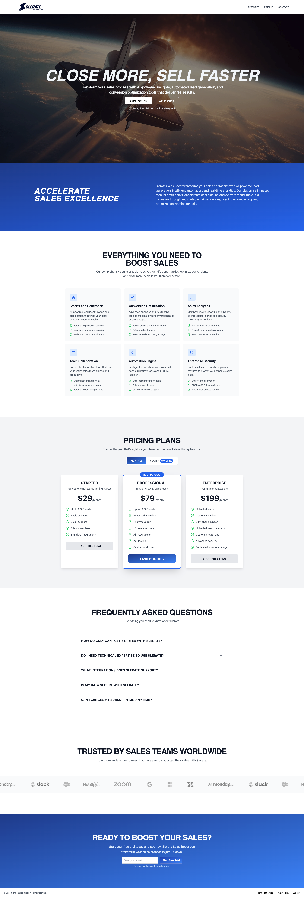

# Slerate Sales Booster - Landing Page

A modern, responsive landing page for Slerate Sales Booster, built with React and featuring smooth animations, interactive components, and a professional design.

## 📸 Screenshots

### Screenshoot



## 🚀 Features

### Core Functionality
- **Responsive Design** - Optimized for desktop, tablet, and mobile devices
- **Smooth Animations** - Powered by Framer Motion for engaging user experience
- **Interactive Navigation** - Smooth scrolling between sections
- **Dynamic Pricing** - Toggle between monthly and yearly pricing plans
- **FAQ Section** - Expandable FAQ items with smooth animations
- **Client Logo Marquee** - Infinite scrolling client testimonials
- **Contact Form** - Email subscription with validation

### Technical Features
- **React 18** - Modern React with functional components and hooks
- **Framer Motion** - Advanced animations and transitions
- **Tailwind CSS** - Utility-first CSS framework for styling
- **Lucide React** - Beautiful, customizable icons
- **ESLint** - Code quality and consistency
- **Responsive Images** - Optimized image loading and display

## 🛠️ Tech Stack

- **Frontend Framework**: React 18
- **Styling**: Tailwind CSS
- **Animations**: Framer Motion
- **Icons**: Lucide React
- **Build Tool**: Vite
- **Code Quality**: ESLint
- **Font**: Teko (Google Fonts)

## 📁 Project Structure

```
slerate-sales-booster-lp/
├── public/
│   ├── index.html
│   └── favicon.ico
├── src/
│   ├── assets/
│   │   ├── clients/
│   │   │   ├── 1.png
│   │   │   ├── 2.png
│   │   │   └── ... (8 client logos)
│   │   ├── plane.webp
│   │   └── slerate-sales-boost-logo.png
│   ├── components/
│   │   └── navbar.jsx
│   ├── landing-page.jsx
│   ├── App.jsx
│   └── main.jsx
├── screenshots/
│   └── (page screenshots)
├── package.json
├── tailwind.config.js
├── vite.config.js
└── README.md
```

## 🚦 Getting Started

### Prerequisites
- Node.js (v18 or higher)
- npm or yarn package manager

### Installation

1. **Clone the repository**
   ```bash
   git clone https://github.com/yourusername/slerate-sales-booster-lp.git
   cd slerate-sales-booster-lp
   ```

2. **Install dependencies**
   ```bash
   npm install
   # or
   yarn install
   ```

3. **Start the development server**
   ```bash
   npm run dev
   # or
   yarn dev
   ```

4. **Open your browser**
   Navigate to `http://localhost:5173`

### Building for Production

```bash
npm run build
# or
yarn build
```

The built files will be in the `dist` directory.

## 📋 Available Scripts

- `npm run dev` - Start development server
- `npm run build` - Build for production
- `npm run preview` - Preview production build locally
- `npm run lint` - Run ESLint for code quality

## 🎨 Design System

### Color Palette
- **Primary Blue**: `#1e3a8a` to `#3b82f6` (gradient)
- **Secondary**: `#6b7280` (gray-500)
- **Background**: `#f9fafb` (gray-50)
- **Text**: `#111827` (gray-900)
- **Accent**: `#10b981` (green-500)

### Typography
- **Headings**: Teko font family (uppercase, bold)
- **Body**: System font stack
- **Responsive scaling**: `text-3xl` to `text-6xl` based on screen size

### Animations
- **Scroll Animations**: Triggered when elements enter viewport
- **Hover Effects**: Subtle scale and color transitions
- **Page Load**: Staggered animations for hero content
- **Marquee**: Infinite scrolling client logos

## 📱 Responsive Breakpoints

- **Mobile**: `< 768px`
- **Tablet**: `768px - 1024px`
- **Desktop**: `> 1024px`
- **Large Desktop**: `> 1280px`

## 🧩 Component Overview

### Navbar Component
- Responsive navigation with mobile hamburger menu
- Smooth scrolling to page sections
- Sticky positioning with backdrop blur

### Landing Page Sections
1. **Hero Section** - Animated background with CTA buttons
2. **About Section** - Company introduction with gradient background
3. **Features Section** - 6 feature cards with icons and descriptions
4. **Pricing Section** - 3 pricing tiers with monthly/yearly toggle
5. **FAQ Section** - Expandable questions with smooth animations
6. **Social Proof** - Client logos marquee
7. **CTA Section** - Email subscription form
8. **Footer** - Company links and copyright

## 🎯 Performance Optimizations

- **Lazy Loading** - Images load as they enter viewport
- **Animation Optimization** - GPU-accelerated transforms
- **Code Splitting** - Dynamic imports for better load times
- **Image Optimization** - WebP format for better compression
- **CSS Purging** - Unused Tailwind classes removed in production

## 🔧 Customization

### Adding New Sections
1. Create new section in `landing-page.jsx`
2. Add corresponding navigation item in `navbar.jsx`
3. Include section ID for smooth scrolling

### Modifying Colors
Update the color scheme in `tailwind.config.js`:
```javascript
module.exports = {
  theme: {
    extend: {
      colors: {
        primary: {
          // Your custom colors
        }
      }
    }
  }
}
```


## 📄 License

This project is licensed under the MIT License - see the [LICENSE](LICENSE) file for details.


## 🙏 Acknowledgments

- [Framer Motion](https://www.framer.com/motion/) for animations
- [Tailwind CSS](https://tailwindcss.com/) for styling
- [Lucide React](https://lucide.dev/) for icons
- [Unsplash](https://unsplash.com/) for stock images

---

**Built with ❤️ by the Agil Saputra**